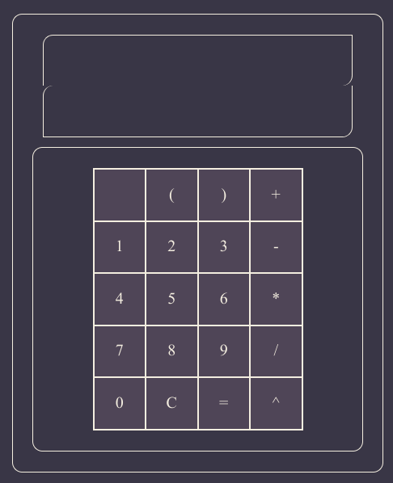

# Calculator-Oden-Project
### Looks Like


## Built With
1. Javascript 
2. Css 
3. Html 

## Acknowledge
[Icons 8](https://icons8.com/)

## How to run
1. Clone
```bash
git clone git@github.com:joelwillSeek/Calculator-Oden-Project.git
```
2. How to run
Open the index.html in Browser